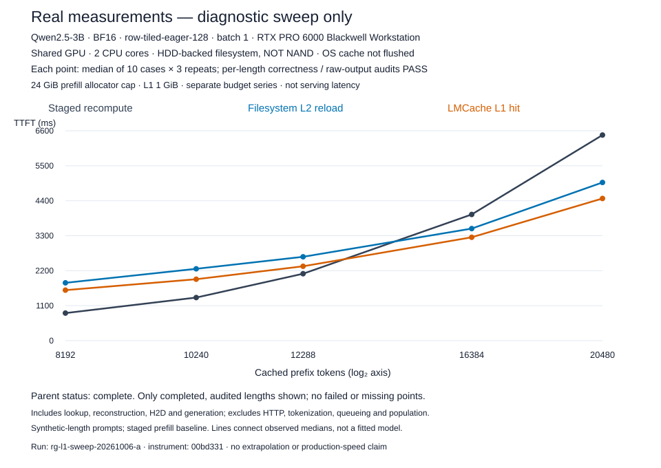

# Measured KV-cache reuse sweep

[PNG](figures/measured-sweep.png) · [SVG](figures/measured-sweep.svg) ·
[Measured medians CSV](figures/measured-sweep.csv)

Run `rg-l1-sweep-20261006-a`, instrument `00bd331`. All five per-length raw
correctness/storage audits passed. Each median uses ten cases × three repeats.

| Prefix tokens | Recompute TTFT | RAM-cache hit TTFT | Filesystem reload TTFT |
| ---: | ---: | ---: | ---: |
| 8,192 |868ms|1,589ms|1,819ms|
| 10,240 |1,356ms|1,932ms|2,260ms|
| 12,288 |2,105ms|2,339ms|2,637ms|
| 16,384 |3,969ms|3,251ms|3,525ms|
| 20,480 |6,466ms|4,471ms|4,975ms|

Both cache paths first beat recompute at the sampled16K point. The observations
bracket the transition between12K and16K; no fitted exact crossover is claimed.

Qwen2.5-3B BF16, RTX PRO6000 Blackwell Workstation, batch1, row-tiled-eager-128,
two CPU cores,24GiB prefill allocator and1GiB L1. HDD-backed filesystem with
OS page cache enabled. Shared-resource diagnostic, not production serving,
physical NAND measurements, or an R-attention speedup. Includes lookup/RPC,
reconstruction,H2D,generation and logit capture; excludes HTTP/tokenization,
queueing,startup,offline population and raw tensor persistence. Lines connect
measured medians; no extrapolation. Historical failures remain excluded.

Project is paused; publishing this chart does not restart experiments.
